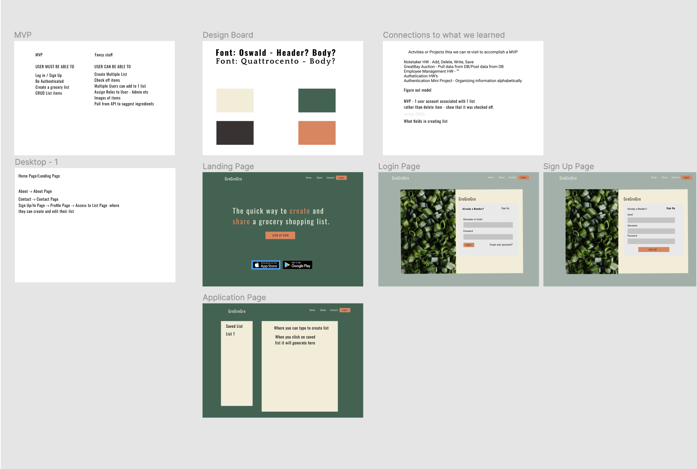
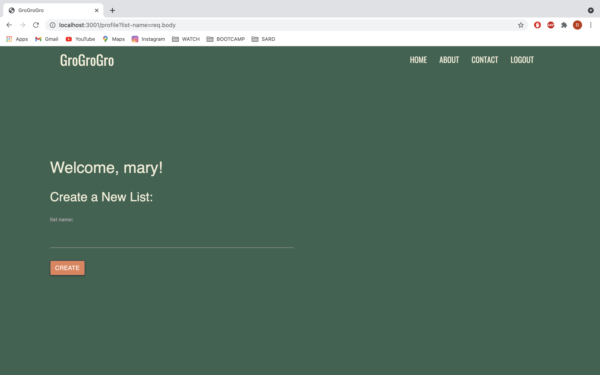

# GroGroGro
## Description
From the brilliant minds of Half&Half comes a web applications that ease the pain of remembering family household list. GroGroGro create a grocecy list the entire family have access too. Members of the family can read,add, and update the family list while the administator can delete items. 
## Access
Check out how GroGroGro at
Deployed URL: https://grogrogro.herokuapp.com/
Github Repo: https://github.com/vegaryanneil/grogrogro
## Usage
GroGroGro is easy to use. Users can sign up our website https://grogrogro.herokuapp.com/ and become the admininstrator and create a list. GroGroGro will then create a list and allow user to input the grocery needs.User is able to save the list and also delete a list if neccessary.
## Our Design Process
We took inspiration from noteTaker. We chose to use colors that were fresh and inviting to our users. We created a mock-up design on Figma.
Figma Mockup: https://www.figma.com/file/BCAomqD4a50tOaA1pe8K9y/GroGroGro?node-id=0%3A1

Our deployed version is a much cleaner version of our mock-up. We wanted to make it clear to where all the actions happen. Here is a GIF file of our entire project.

## Future Directions
We have some ideas for the future of GroGroGro. We want to get our MultiMember Feature fully functional. This feature allows users to invite memebers to edit and write on list.We also want to attach photos next to the item listed and implement the abilty to scratch an item off.  Lastly, we want to add a feature to share list with members outside the home too
## Contributors and Roles
Ricardo Flores - Lead CSS Developer
Main Tasks - Designed all the pages in the actual application. 
https://github.com/richardflowersxx

Dwayne Hovington - Lead Backend Database Developer
Main Tasks - Developed the database. Developed all the micro interactions throughout the entire project.
https://github.com/hov92

Ryan Vega - Lead CSS Developer, Designer
Main Tasks - Created initial mockup design of the project. Designed all the pages in the actual application. Made all the pages responsive.
https://github.com/vegaryanneil

Stevenson White - Lead Backend Database Developer
Main Tasks - Developed the database. Developed all the micro interactions throughout the entire project.
https://github.com/sawhite110
